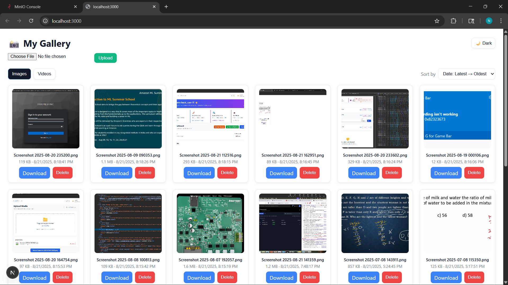
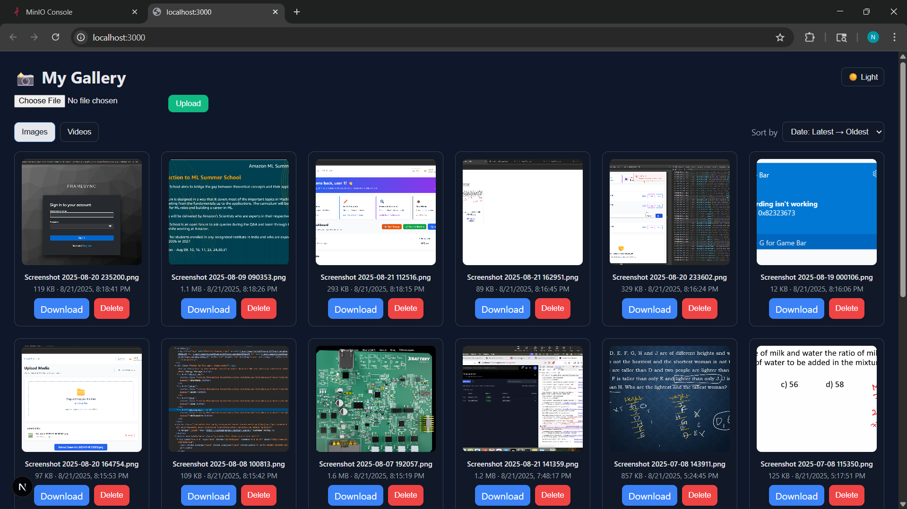
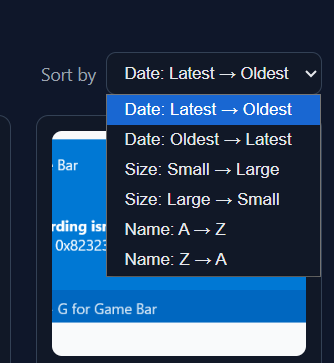

## My Gallery

A lightweight Next.js app to upload, list, preview, download, and delete images and videos on an S3‑compatible storage (MinIO locally, AWS S3 in production). Includes light/dark theme and sorting.

For full details, see `ProjectExplanation.md`.

## Visual Tour

### Light Mode


- Shows the default light theme.
- Media are displayed in a responsive grid; images render as previews, videos render with controls.
- Header provides upload form, tabs to switch Images/Videos, sorting, and theme toggle.

### Dark Mode


- Demonstrates the dark theme using CSS variables.
- Toggle switches between light and dark; preference persists via `localStorage` and respects system preference on first load.

### Sort By Controls


- Sorting options: Date (Latest → Oldest, Oldest → Latest), Size (Small → Large, Large → Small), Name (A → Z, Z → A).
- Sorting applies independently within the active tab (Images or Videos).

## Quick Start
```bash
npm install
npm run dev
# open http://localhost:3000
```

Ensure your environment variables are set (see `local .env` example and `ProjectExplanation.md`).


